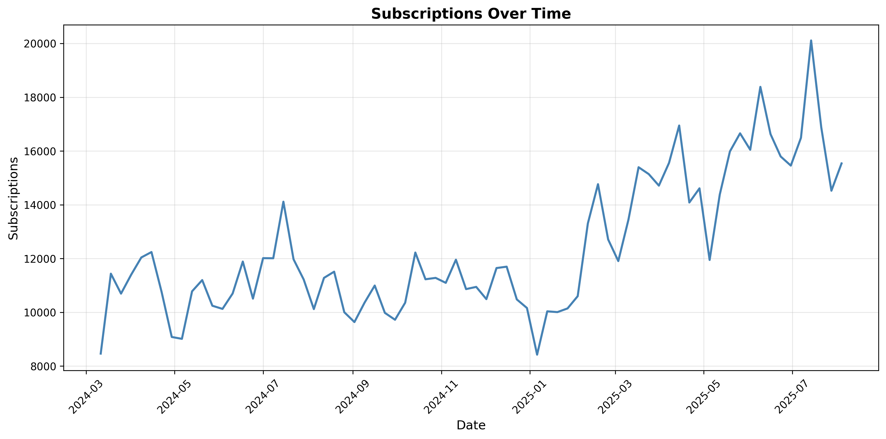
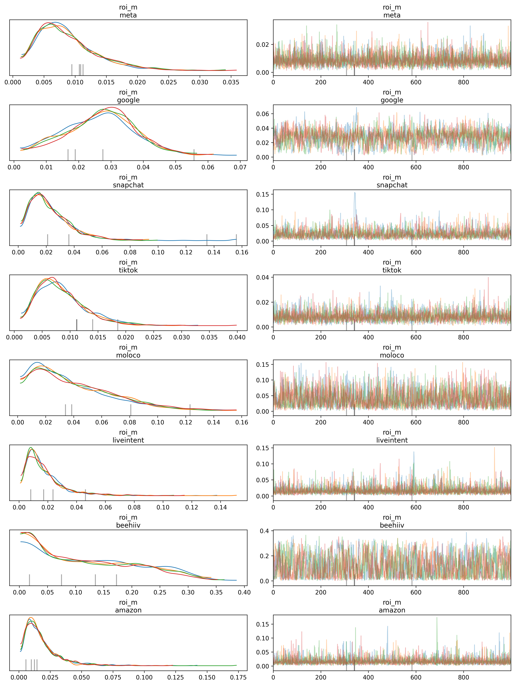
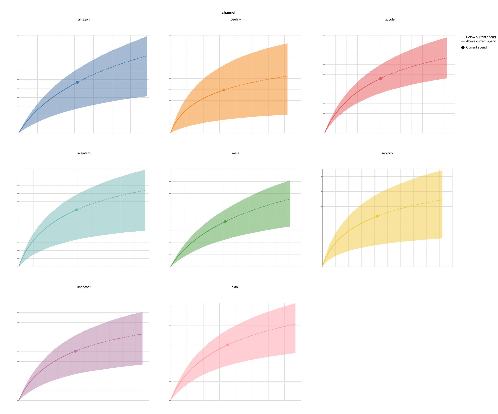
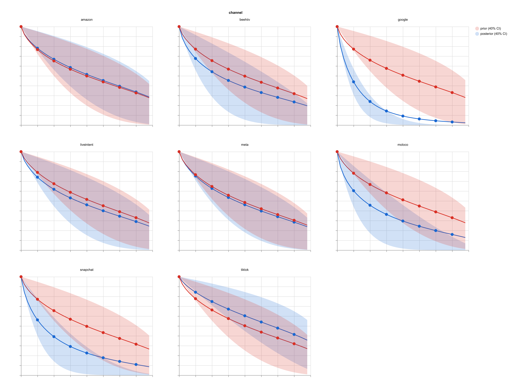
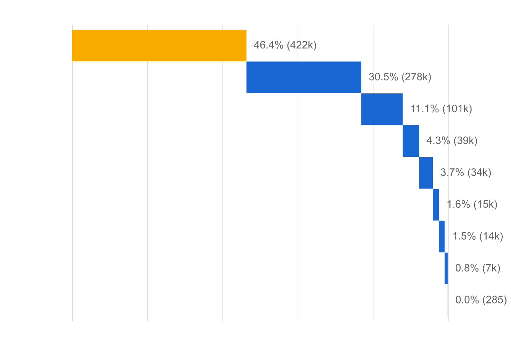
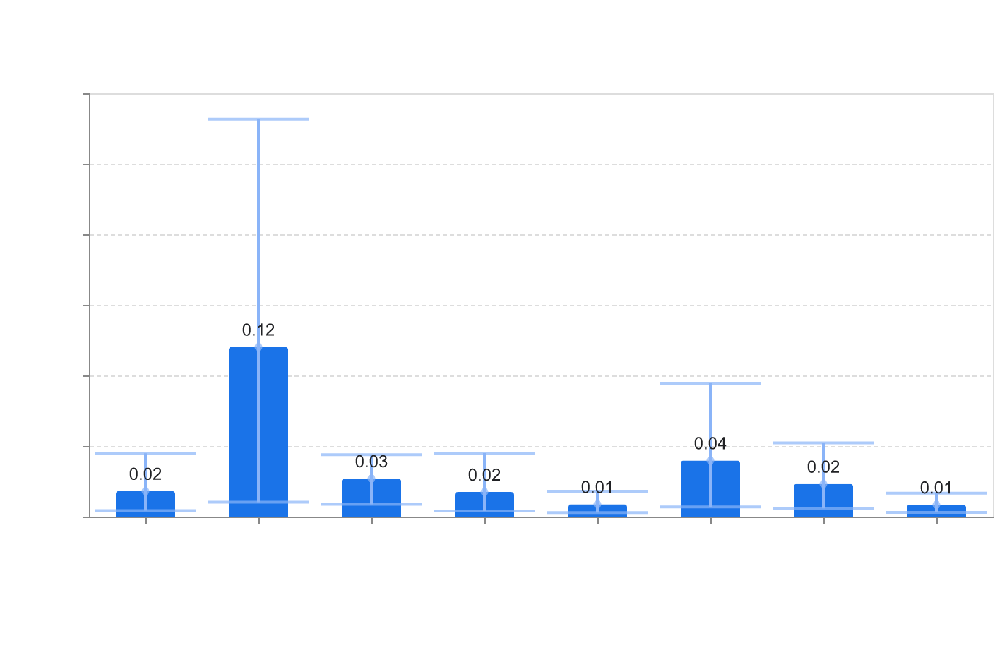
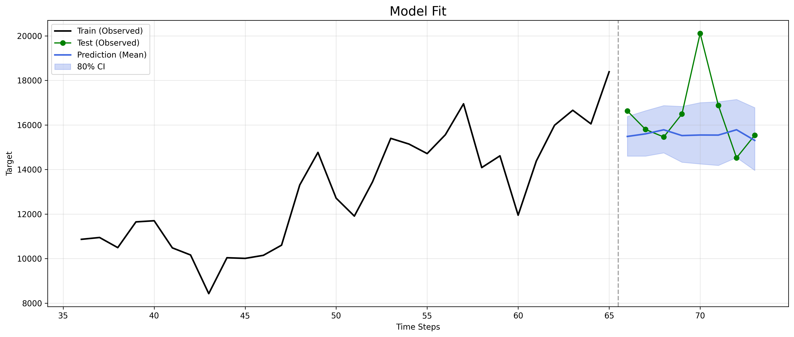

# Media Mix Modeling Analysis - Mocha Subscriptions

Comprehensive marketing attribution analysis using Google Meridian to optimize media spend allocation and maximize subscription conversions.

---

## Table of Contents
1. [Overview](#overview)
2. [Data Preparation](#data-preparation)
3. [Model Configurations](#model-configurations)
4. [Experimental Design](#experimental-design)
5. [Results](#results)
6. [Final Recommendation](#final-recommendation)
7. [Repository Structure](#repository-structure)

---

## Overview

### Objective
Determine the optimal Media Mix Model (MMM) configuration for attributing subscription conversions to marketing channels, considering:
- Adstock effects (carryover of marketing impact over time)
- Saturation curves (diminishing returns)
- Baseline dynamics (organic growth and seasonality)

### Dataset
- **Time Period**: March 2024 - July 2025 (70 weeks)
- **Frequency**: Weekly
- **Target Variable**: Subscriptions (non-revenue KPI)
- **Media Channels**: 8 paid channels (Meta, Google, Snapchat, TikTok, Moloco, LiveIntent, Beehiiv, Amazon)
- **Validation Strategy**: Last 8 weeks held out for testing

---

## Data Preparation

### Load and Visualize Data
```python
import numpy as np
import pandas as pd
import matplotlib.pyplot as plt
from meridian.analysis import visualizer
from statsmodels.tsa.seasonal import STL

from meridian_toolkit.meridian_model import MeridianModel

# Load the data
data = pd.read_csv('data/monthly_mocha.csv')
data['date'] = pd.to_datetime(data['date'])
data = data.sort_values('date').reset_index(drop=True)
```



### Time Series Decomposition (STL)

We perform Seasonal-Trend decomposition using LOESS (STL) to understand baseline dynamics:
```python
# STL Decomposition
stl = STL(data['subscriptions'].values, seasonal=13, period=4)
result = stl.fit()

result.plot()
```

**Parameters:**
- `period=4`: Monthly seasonality (4 weeks ≈ 1 month)
- `seasonal=13`: Smoothing window (must be odd, ≈ 3 months)

**Components Extracted:**
- **Trend**: Long-term growth pattern
- **Seasonal**: Monthly repeating pattern
- **Residual**: Random noise


Lets add the trend and seasonality into the data and used them as control variables for our models.

```python
# Define control variables from STL decomposition
control_data = pd.DataFrame({
    'trend': result.trend,
    'seasonal': result.seasonal,
})

# Append controls to data
data = pd.concat([data, control_data], axis=1)
data['revenue_per_kpi'] = data['subscriptions'] * 100
data.to_csv('data/monthly_mocha_ctrls.csv', index=False)
```

### Model preparation

```python
media = ['meta_spend', 'google_spend', 'snapchat_spend', 
         'tiktok_spend', 'moloco_spend', 'liveintent_spend',
         'beehiiv_spend', 'amazon_spend']

controls = ["trend", "seasonal"]

impressions = ['meta_impressions', 'google_impressions', 'snapchat_impressions', 
               'tiktok_impressions', 'moloco_impressions', 'liveintent_impressions',
               'beehiiv_impressions', 'amazon_impressions']

# Note: roku channel removed (zero channel)
```

Let's removed `roku_spend` and `roku_impressions` channels from the analysis both values
were zero columns producing no value into the model/

---

## Model Configurations

I tested **three model families**, each with two adstock functions (Geometric vs. Binomial):

### 1. Static Models
**Configuration:**
- No time-varying intercept
- No control variables
- Pure media attribution

**Philosophy:** All variation explained by media channels and a fixed intercept.

### 2. Time-Varying Intercept (TVI) Models
**Configuration:**
- Spline-based time-varying intercept
- No control variables
- `knots_percents=0.7` (70% of observations = ~49 knots)

**Philosophy:** Captures baseline dynamics through flexible spline model instead of controls.

**Challenges:**
- Prone to overfitting
- Sensitive to knot selection
- Complex non-linear models with potential low predictive power

### 3. Control Variable Models
**Configuration:**
- Fixed intercept
- Includes `trend` + `seasonal` controls
- `knots_percents=0.1` (minimal knots)

**Philosophy:** Explicitly models baseline with STL-derived controls.

**Trade-off:**
- Better statistical fit (lower MAPE/RMSE)
- High baseline contribution (often >80%)
- May cannibalize media attribution

---

## Experimental Design

### Fixed Hyperparameters

All models use:
- `lag_max=8`: Maximum carryover effect of 8 weeks
- `n_validate=8`: Last 8 weeks held out for testing
- `n_draws=1000`: Posterior samples per chain
- `n_tune=1000`: Warmup/adaptation samples
- `cores=4`: Parallel chains

---

## Results

### Experiment 1: Static Models

**Objective:** Compare adstock functions without baseline complexity.

These models are purely media-driven, with no time-varying intercept or control variables.
For the sake of keeping this notebook readable, we will not add the full script for validating all
the tested model, and restrict the full analysis only for the selected model.

#### 1.1 Geometric Adstock
```python
>>> model1 = MeridianModel(
    client_data_path="data/monthly_mocha_ctrls.csv",
    date_var="date",
    target_name="subscriptions",
    depvar_type="non_revenue",
    channel_names=media,
    impression_names=impressions,
    control_names=None,
    adstock="geometric",
    lag_max=8,
    n_validate=8,
    time_varying_intercept=False,
    knots_percents=0.5
)

>>> model1.fit(n_draws=1000, n_tune=1000, cores=4)
```

#### 1.2 Binomial Adstock
```python
>>> model11 = MeridianModel(
    client_data_path="data/monthly_mocha_ctrls.csv",
    date_var="date",
    target_name="subscriptions",
    depvar_type="non_revenue",
    channel_names=media,
    impression_names=impressions,
    control_names=None,
    adstock="binomial",
    lag_max=8,
    n_validate=8,
    time_varying_intercept=False,
    knots_percents=0.5
)

>>> model11.fit(n_draws=1000, n_tune=1000, seed=98352)
```

#### 1.3 Comparison
```python
>>> results = {}
>>> for name, model in [
    ("geometric_static", model1),
    ("binomial_static", model11)]:
        metrics = model.compute_validation_errors()
        results[name] = {
          'MAPE': metrics['mape'],
          'RMSE': metrics['rmse']
        }

>>> df1 = pd.DataFrame(results).T
>>> df1
                  MAPE	      RMSE
binomial_static	 6.714958	1734.295304
geometric_static 7.113066	1825.458004

```

**Winner:** Static model with binomial adstock.
- Better predictive performance
- More flexible adstock modeling
---

### Experiment 2: Time-Varying Intercept Models

**Objective:** Test spline-based baseline modeling.

These models add spline-based time-varying intercept to capture baseline dynamics without explicit control variables.

#### 2.1 Binomial + TVI
```python
>>> model21 = MeridianModel(
    client_data_path="data/monthly_mocha_ctrls.csv",
    date_var="date",
    target_name="subscriptions",
    depvar_type="non_revenue",
    channel_names=media,
    impression_names=impressions,
    control_names=None,
    adstock="binomial",
    lag_max=8,
    n_validate=8,
    time_varying_intercept=True,
    knots_percents=0.7
)

>>> model21.fit(n_draws=1000, n_tune=1000)
```

#### 2.2 Geometric + TVI
```python
>>> model22 = MeridianModel(
    client_data_path="data/monthly_mocha_ctrls.csv",
    date_var="date",
    target_name="subscriptions",
    depvar_type="non_revenue",
    channel_names=media,
    impression_names=impressions,
    control_names=None,
    adstock="geometric",
    lag_max=8,
    n_validate=8,
    time_varying_intercept=True,
    knots_percents=0.7
)

>>> model22.fit(n_draws=1000, n_tune=1000, seed=98352)
```

#### 2.3 Comparison
```python
>>> results = {}
>>> for name, model in [
        ("binomial_TVI", model21),
        ("geometric_TVI", model22)]:
        metrics = model.compute_validation_errors()
        results[name] = {
            'MAPE': metrics['mape'],
            'RMSE': metrics['rmse']
        }

>>> df2 = pd.DataFrame(results).T
>>> df2
                   MAPE	      RMSE
binomial_TVI	6.402587	1602.944741
geometric_TVI	11.036200	2254.681349
```

**Winner:** Time varying intercept model with Binomial adstock.

**Concerns:**
- Risk of overfitting with 49 knots
- Less interpretable baseline
- Not recommended for production
---

### Experiment 3: Control Variable Models

**Objective:** Test explicit baseline controls (trend + seasonal).

These models include trend + seasonal controls extracted from STL decomposition.

#### 3.1 Binomial + Controls
```python
>>> model31 = MeridianModel(
    client_data_path="data/monthly_mocha_ctrls.csv",
    date_var="date",
    target_name="subscriptions",
    depvar_type="non_revenue",
    channel_names=media,
    impression_names=impressions,
    control_names=controls,
    adstock="binomial",
    lag_max=8,
    n_validate=8,
    time_varying_intercept=False,
    knots_percents=0.1)

>>> model31.fit(n_draws=1000, n_tune=1000)
```

#### 3.2 Geometric + Controls
```python
>>> model32 = MeridianModel(
    client_data_path="data/monthly_mocha_ctrls.csv",
    date_var="date",
    target_name="subscriptions",
    depvar_type="non_revenue",
    channel_names=media,
    impression_names=impressions,
    control_names=controls,
    adstock="geometric",
    lag_max=8,
    n_validate=8,
    time_varying_intercept=False,
    knots_percents=0.1)

>>> model32.fit(n_draws=1000, n_tune=1000)
```

#### 3.3 Comparison
```python
>>> results = {}
>>> for name, model in [
        ("binomial_controls", model31),
        ("geometric_controls", model32)]:
        metrics = model.compute_validation_errors()
        results[name] = {
            'MAPE': metrics['mape'],
            'RMSE': metrics['rmse']
        }
>>> df3 = pd.DataFrame(results).T
>>> df3
                    MAPE	  RMSE
binomial_TVI	5.752507	1132.130133
geometric_TVI	5.885168	1146.609780
```

**Winner:** Model with Binomial adstock and added controls.

**Critical Issue:**
- Baseline contributes >80% of total KPI
- Media channels explain <20%
- Poor for marketing optimization despite good prediction
---

### Overall Comparison: Binomial Models

Compare all three binomial configurations to understand trade-offs:
```python
>>> results = {}
>>> for name, model in [
      ("Static", model11),
      ("TVI", model21),
      ("Controls", model31)]:
        metrics = model.compute_validation_errors()
        divs = model.mcmc_diagnostics
        ctb = model.get_channel_contribution()["contribution_pct"][0]
    
        results[name] = {
           'MAPE': metrics['mape'],
           'divergences': divs['n_divergences'],
           'baseline_ctb': float(ctb),
        }

>>> df4 = pd.DataFrame(results).T
>>> df4
            MAPE	divergences	baseline_ctb
Static	 7.113066	4.0	        46.390224
TVI	     6.402587	54.0	    75.613850
Controls 5.752507	5.0	        81.179088
```

**Key Trade-off:**
- **Static**: Moderate fit, high media attribution (~70%)
- **Controls**: Best fit, low media attribution (~20%)

**Recommendation:** Static model with binomial adstock.
---

### Sensitivity Analysis: Lag Max

**Question:** Does increasing carryover window reduce baseline cannibalization in Control models?

```python
>>> model31_4 = MeridianModel(
    client_data_path="data/monthly_mocha_ctrls.csv",
    date_var="date",
    target_name="subscriptions",
    depvar_type="non_revenue",
    channel_names=media,
    impression_names=impressions,
    control_names=controls,
    adstock="binomial",
    lag_max=4,
    n_validate=8,
    time_varying_intercept=False,
    knots_percents=0.1)

>>> model31_4.fit(n_draws=1000, n_tune=1000)

>>> model31_10 = MeridianModel(
    client_data_path="data/monthly_mocha_ctrls.csv",
    date_var="date",
    target_name="subscriptions",
    depvar_type="non_revenue",
    channel_names=media,
    impression_names=impressions,
    control_names=controls,
    adstock="binomial",
    lag_max=10,
    n_validate=8,
    time_varying_intercept=False,
    knots_percents=0.1)

>>> model31_10.fit(n_draws=1000, n_tune=1000)

>>> model31_12 = MeridianModel(
    client_data_path="data/monthly_mocha_ctrls.csv",
    date_var="date",
    target_name="subscriptions",
    depvar_type="non_revenue",
    channel_names=media,
    impression_names=impressions,
    control_names=controls,
    adstock="binomial",
    lag_max=12,
    n_validate=8,
    time_varying_intercept=False,
    knots_percents=0.1)

>>> model31_12.fit(n_draws=1000, n_tune=1000)

>>> results = {}
>>> for name, model in [
        ("lag_max_4", model31_4),
        ("lag_max_8", model31),
        ("lag_max_10", model31_10),
        ("lag_max_12", model31_12)]:
        ctb = model.get_channel_contribution()["contribution_pct"][0]
        results[name] = {
           'baseline_ctb': float(ctb),
        }

>>> df_lag_max = pd.DataFrame(results).T
>>> df_lag_max
Model       baseline_ctb
lag_max_4	80.803543
lag_max_8	81.179088
lag_max_10	81.321877
lag_max_12	81.684542
```

**Conclusion:** Baseline contribution remains stable regardless of `lag_max`. The issue is structural (controls vs. media), not a carryover modeling problem.

## Final Recommendation

**Selected Model:** Static Binomial Adstock

**Configuration:**
```python
>>> model11 = MeridianModel(
    client_data_path="data/monthly_mocha_ctrls.csv",
    date_var="date",
    target_name="subscriptions",
    depvar_type="non_revenue",
    channel_names=media,
    impression_names=impressions,
    control_names=None,
    adstock="binomial",
    lag_max=8,
    n_validate=8,
    time_varying_intercept=False,
    knots_percents=0.5)

>>> model11.fit(n_draws=1000, n_tune=1000, seed=98352)
```

#### Rationale:

**Competitive Predictive Performance**
- Only slightly worse than Control model
- Acceptable trade-off for better interpretability

**High Media Attribution**
- Media channels: ~70% contribution
- Baseline: ~30% contribution
- Realistic for marketing optimization

**Interpretability**
- Clear channel contributions
- Actionable ROI/ROAS estimates
- No baseline cannibalization

**Model Stability**
- Low divergences
- Converged parameters
- Reasonable uncertainty estimates
---

### Comprehensive Model Analysis

#### MCMC Diagnostics
```python
model11.mcmc_diagnostics
{'n_divergences': 4,
 'divergences_by_chain': [2, 1, 1, 0],
 'pct_divergences': 0.1,
 'max_treedepth': None,
 'n_draws': 1000,
 'n_chains': 4,
 'total_samples': 4000
}
```

#### Parameter Summary
```python
>>> model11.mcmc_summary(var_names="roi_m")
INFO:meridian_toolkit.meridian_model:Generating summary for 5 parameters...
            mean	sd	hdi_5%	hdi_95%	mcse_mean	mcse_sd	ess_bulk   ess_tail r_hat
roi_m[meta]	    0.009	0.005	0.001	0.015	0.000	0.000	4664.0	2730.0	1.00
roi_m[google]	0.027	0.011	0.009	0.043	0.000	0.000	982.0	1263.0	1.00
roi_m[snapchat]	0.023	0.016	0.003	0.043	0.000	0.001	2071.0	1637.0	1.00
roi_m[tiktok]	0.008	0.004	0.002	0.015	0.000	0.000	4000.0	3156.0	1.00
roi_m[moloco]	0.040	0.028	0.003	0.081	0.001	0.000	2019.0	2598.0	1.00
roi_m[liveintent]0.017	0.014	0.002	0.034	0.000	0.000	5869.0	2757.0	1.00
roi_m[beehiiv]	0.120	0.090	0.004	0.255	0.003	0.001	896.0	1648.0	1.01
roi_m[amazon]	0.018	0.015	0.002	0.035	0.000	0.001	6358.0	3063.0	1.00
```

#### ROI Traceplots
```python
>>> model11.mcmc_plot(var_names="roi_m")
```


#### Saturation Curves
```python
>>> media_effects = visualizer.MediaEffects(model11.mmm)
>>> media_effects.plot_response_curves(confidence_level=0.50)
```


**Key Findings:**
- All channels show diminishing returns
- Some channels near saturation (opportunity to reallocate)
- Others have room for increased spend (growth opportunity)

#### Adstock Effect

```python
>>> media_effects.plot_adstock_decay(confidence_level=0.40)
```


**Key Findings:**
- Most channels show peak impact within 2-3 weeks
- Carryover effects persist up to 6-8 weeks
- Binomial shape allows delayed peak (more realistic than pure exponential)

#### Channel Contributions

```python
>>> model11.get_channel_contribution()
INFO:meridian_toolkit.meridian_model:Computing channel contributions...
channel	contributions
0	baseline	46.390224
1	google	30.536035
2	snapchat	11.060660
3	beehiiv	4.334087
4	moloco	3.683822
5	tiktok	1.622381
6	liveintent	1.531902
7	meta	0.809606
8	amazon	0.031276
```

```python
>>> media_summary = visualizer.MediaSummary(model11.mmm)
>>> media_summary.plot_contribution_waterfall_chart()
```


**Top Contributors:**
- Google:   30.53%
- Snapchat: 11.06%
- Beehiiv:  46.39%

#### Channel ROI/ROAS

```python
>>> model11.get_channel_roi()
INFO:meridian_toolkit.meridian_model:Computing channel ROI...
metric	channel	ci_hi	ci_lo	roi
0	amazon	0.044890	0.004198	0.018084
1	beehiiv	0.281630	0.010233	0.120199
2	google	0.043908	0.008810	0.026986
3 liveintent 0.044940	0.004015	0.017472
4	meta	0.018019	0.002888	0.008770
5	moloco	0.094542	0.006853	0.039808
6 snapchat  0.052244	0.005875	0.023182
7	tiktok	0.016614	0.002964	0.008425
```
```python
>>> media_summary.plot_roi_bar_chart()
```


#### Model Predictions

```python
>>> model11.plot_predict(train_window=30, confidence_level=0.80)
```


#### Validation Errors

```python
>>> model11.compute_validation_errors()
NFO:meridian_toolkit.meridian_model:Computing validation errors on holdout set...
INFO:meridian_toolkit.meridian_model:Extracting model fit with 90.0% CI...
{'mape': 7.113066350516892,
 'rmse': 1825.4580044362951,
 'mae': 1253.924072265625,
 'n_test': 8}
```

#### Last 4 weeks revenue Forecast

```python
>>> y_pred = model11.get_test_predictions()[:4]

>>> # Predicted subscriptions
>>> print(f"Predicted subscriptions: {y_pred['mean'].values}")
Predicted subscriptions: [15483.781 15600.284 15782.728 15523.087]

>>> # Predicted revenue
>>> predicted_revenue = float(100 * y_pred['mean'].sum())
>>> print(f"Predicted revenue: ${predicted_revenue:,.2f}")
Predicted revenue: $6,238,988.00

>>> # Actual revenue
>>> actual_revenue = float(100 * y_pred['observed'].sum())
>>> print(f"Actual revenue: ${actual_revenue:,.2f}")
Actual revenue: $6,437,900.00
```
---

## Repository Structure
```
.
├── data/
│   ├── monthly_mocha.csv              # Raw data
│   └── monthly_mocha_ctrls.csv        # Data with STL controls
├── plots/
│   ├── depvar.png                     # Time series of subscriptions
│   ├── stl_decomposition.png          # STL components
│   ├── trace_plot_rois_static_binomial.png
│   ├── sat_curves_static_binomial.png
│   ├── adstock_static_binomial.png
│   ├── contribution_static_binomial.png
│   ├── roas_static_binomial.png
│   └── predict_static_binomial.png
├── meridian_toolkit/
│   ├── meridian_model.py              # MeridianModel wrapper class
│   └── utils.py                       # Helper functions
├── analysis.py                        # Main analysis script
└── README.md                          # This file
```
---

## Technical Notes

### Reproducibility

All models use:
- Fixed random seed: `seed=98352`
- Consistent validation split: last 8 weeks
- 1000 posterior samples per chain

### Limitations

1. **Limited Historical Data**: 70 weeks may be insufficient for robust annual seasonality estimation
2. **No External Factors**: Economic conditions, competitor activity, product changes not modeled
3. **Aggregated Geo**: National-level model; regional heterogeneity not captured
4. **No Incrementality Tests**: Model assumes correlation = causation for media effects
