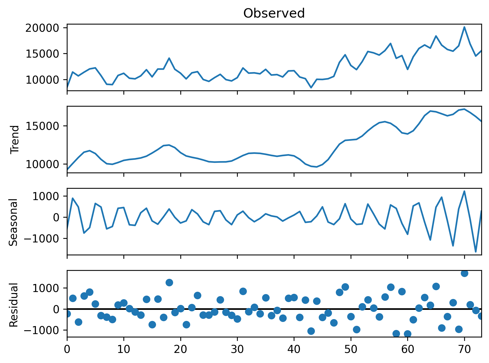

# Monthly Moka model comparison

## 1. Data Loading and Preparation
```python
import numpy as np
import pandas as pd
from statsmodels.tsa.seasonal import STL
from pymc_toolkit.pymc_model import PymcModel
import matplotlib.pyplot as plt

# Load data
data = pd.read_csv('data/monthly_mocha.csv')
data['date'] = pd.to_datetime(data['date'])
data = data.sort_values('date').reset_index(drop=True)
```

Load the dataset and convert dates to datetime format. 
Sort by date to ensure proper time series ordering.

## 2. Exploratory Visualization
```python
plt.plot(data['date'], data['subscriptions'])
plt.close()
```

Quick visualization of the target variable (subscriptions) over time to identify patterns.

## 3. STL Decomposition (Seasonal-Trend Decomposition)
```python
stl = STL(data['subscriptions'].values, seasonal=13, period=4)
result = stl.fit()
mape = np.mean(np.abs(result.resid / data['subscriptions'].values)) * 100
mape
result.plot()
```


Decompose the time series into:
- **Trend**: Long-term direction
- **Seasonal**: Repeating patterns (every 4 weeks = monthly seasonality)
- **Residual**: Random noise

Parameters:
- `seasonal=13`: Window size for seasonal smoothing (must be odd)
- `period=4`: Seasonal cycle length (4 weeks ≈ 1 month)

## 4. Create Control Variables
```python
control_data = pd.DataFrame({
    'trend': result.trend,
    'seasonal': result.seasonal,
})

data = pd.concat([data, control_data], axis=1)
```

Extract trend and seasonal components from STL to use as control variables in the MMM model. This helps the model distinguish between organic growth/seasonality and media effects.

## 5. Define Model Variables
```python
target = "subscriptions"
date_var = "date"

media = ['meta_spend', 'google_spend', 'snapchat_spend', 
         'tiktok_spend', 'moloco_spend', 'liveintent_spend',
         'roku_spend', 'beehiiv_spend', 'amazon_spend']

controls = ["trend", "seasonal"]

organic = ['meta_impressions', 'google_impressions', 'snapchat_impressions', 
           'tiktok_impressions', 'moloco_impressions', 'liveintent_impressions',
           'roku_impressions', 'beehiiv_impressions', 'amazon_impressions']
```

Define the variables for the model:
- **target**: KPI to predict (subscriptions)
- **media**: Marketing spend channels
- **controls**: Non-media factors (trend, seasonality)
- **organic**: Impression data (frequency of exposure)

## 6. Build and Fit MMM Models

A summary of all the model configuration tried so far:

| Model | Adstock | Controls | Impressions | Purpose |
|-------|---------|----------|-------------|---------|
| pfleet (weibull_controls) | Weibull | ✓ | ✗ | Flexible decay + controls |
| pfleet1 (geometric_controls) | Geometric | ✓ | ✗ | Simple decay + controls |
| pfleet2 (geometric_no_controls) | Geometric | ✗ | ✗ | Media-only attribution |
| pfleet3 (geometric_with_impressions) | Geometric | ✗ | ✓ | Spend→Impressions→KPI |
| pfleet4 (geometric_impressions_controls) | Geometric | ✓ | ✓ | Full specification |

**Key Parameters (All Models):**
- **lag_max=4**: Maximum lag effect (media impact up to 4 weeks)
- **scale_data=True**: Normalize variables for better convergence
- **saturation='michaelis_menten'**: Diminishing returns curve
- **n_test=12**: Hold out last 12 weeks for validation
- **adstock=Geometric**: I sticked with Geometric adstock after comparin the model with 
  the Weibull_pdf model. The second model produces divergences and both models are 
  virtually symmetrical.

### Model 1: Weibull with Controls
```python
model = PymcModel(
    client_data=data,
    target_name=target,
    date_column=date_var,
    channel_names=media,
    control_names=controls,
    lag_max=4,
    scale_data=True,
    adstock="weibull",
    saturation='michaelis_menten'
)

pfleet = model.production_fleet(n_test=12)
pfleet.summary()
az.loo(pfleet.mmm.idata, var_name="y", pointwise=True)
pfleet.generate_report(output_html="models/weibull_controls.html")
```
- **adstock="weibull"**: Weibull decay for carryover effects (flexible decay shape)
- **control_names=controls**: Includes trend + seasonal controls
- **saturation='michaelis_menten'**: Diminishing returns curve

### Model 2: Geometric with Controls
```python
model1 = PymcModel(
    client_data=data,
    target_name=target,
    date_column=date_var,
    channel_names=media,
    control_names=controls,
    lag_max=4,
    scale_data=True,
    adstock="geometric",
    saturation='michaelis_menten'
)

pfleet1 = model1.production_fleet(n_test=12)
pfleet1.summary()
az.loo(pfleet1.mmm.idata, var_name="y", pointwise=True)
pfleet1.generate_report(output_html="models/weibull_controls.html")
```

- **adstock="geometric"**: Geometric decay for carryover effects (simpler than Weibull)
- **control_names=controls**: Includes trend + seasonal controls
- Same saturation as Model 1

### Model 3: Geometric without Controls
```python
model2 = PymcModel(
    client_data=data,
    target_name=target,
    date_column=date_var,
    channel_names=media,
    control_names=None,  # No controls
    lag_max=4,
    scale_data=True,
    adstock="geometric",
    saturation='michaelis_menten'
)

pfleet2 = model2.production_fleet(n_test=12)
pfleet2.summary()
az.loo(pfleet2.mmm.idata, var_name="y", pointwise=True)
pfleet2.generate_report(output_html="models/weibull_controls.html")
```

- **control_names=None**: NO trend or seasonal controls
- Tests impact of removing controls on model performance
- All variation must be explained by media channels and intercept

### Model 4: Geometric with Impressions (No Controls)
```python
model3 = PymcModel(
    client_data=data,
    target_name=target,
    date_column=date_var,
    channel_names=media,
    control_names=None,  # No controls
    organic_names=organic,  # Add impressions
    lag_max=4,
    scale_data=True,
    adstock="geometric",
    saturation='michaelis_menten'
)

pfleet3 = model3.production_fleet(n_test=12)
pfleet3.summary()
az.loo(pfleet3.mmm.idata, var_name="y", pointwise=True)
pfleet3.generate_report(output_html="models/weibull_controls.html")
```

- **organic_names=organic**: Adds impression data (media frequency)
- **control_names=None**: No trend/seasonal controls
- Models spend → impressions → KPI relationship

### Model 5: Geometric with Impressions AND Controls
```python
model4 = PymcModel(
    client_data=data,
    target_name=target,
    date_column=date_var,
    channel_names=media,
    control_names=controls,  # With controls
    organic_names=organic,    # With impressions
    lag_max=4,
    scale_data=True,
    adstock="geometric",
    saturation='michaelis_menten'
)

pfleet4 = model4.production_fleet(n_test=12)
pfleet4.summary()
az.loo(pfleet4.mmm.idata, var_name="y", pointwise=True)
pfleet4.generate_report(output_html="models/weibull_controls.html")
```

- **Full model**: Includes both impressions AND controls
- **control_names=controls**: Trend + seasonal
- **organic_names=organic**: Impression data
- Most complex specification

## 7. Model Comparison
```python
# Compare models by CRPS error
results = {}
for name, fleet in [
    ("weibull_controls", pfleet),
    ("geometric_controls", pfleet1),
    ("geometric_no_controls", pfleet2),
    ("geometric_with_impressions", pfleet3),
    ("geometric_impressions_controls", pfleet4)
]:
    metrics = fleet.get_model_accuracy(train=True)
    results[name] = {
        'crps_error': metrics['crps_error'],
        'mape': metrics['mape']
    }

df = pd.DataFrame(results).T.sort_values('crps_error')
>>> df

                model	          crps_error	mape
0	geometric_controls	           0.058940	0.097463
1	weibull_controls	           0.059263	0.098453
2	geometric_no_controls 	       0.088542	0.147429
3	geometric_impressions_controls 0.169136	0.232483
4	geometric_with_impressions	   0.204971	0.280847

```

Compare different model configurations:
- **weibull_controls**: Weibull adstock + controls
- **geometric_controls**: Geometric adstock + controls
- **geometric_no_controls**: No trend/seasonal controls
- **geometric_with_impressions**: Impressions data included
- **geometric_impressions_controls**: Impressions + controls

Lower CRPS and MAPE indicate better predictive performance.

## 8. Contribution Analysis
```python
# Compare contributions across models
results = []
for name, fleet in [
    ("weibull_controls", pfleet),
    ("geometric_controls", pfleet1),
    ("geometric_no_controls", pfleet2),
    ("geometric_with_impressions", pfleet3),
    ("geometric_impressions_controls", pfleet4)
]:
    contrib = fleet.mmm.compute_mean_contributions_over_time().sum()
    total = contrib.sum()
    
    # Individual channel contributions
    channel_contribs = {}
    for channel in fleet.mmm.channel_columns:
        channel_contribs[channel] = (contrib[channel] / total * 100)
    
    # Control contributions
    controls = contrib[fleet.mmm.control_columns].sum() / total * 100 if fleet.mmm.control_columns else 0
    
    # Intercept contribution
    intercept = contrib['intercept'] / total * 100 if 'intercept' in contrib else 0
    
    results.append({
        'model': name,
        **channel_contribs,
        'controls_pct': controls,
        'intercept_pct': intercept
    })

df = pd.DataFrame(results)
>>> print(df.to_string(index=False))
                         model  media_pct  controls_pct  intercept_pct
              weibull_controls  41.311423     51.194695       7.493882
            geometric_controls  45.374855     47.669822       6.955323
         geometric_no_controls  84.494306      0.000000      15.505694
    geometric_with_impressions  93.811920      0.000000       6.188080
geometric_impressions_controls  85.835308      8.099114       6.065578
```

Analyze how much each component contributes to the target KPI:
- **Media channels**: Individual contribution of each marketing channel
- **Controls**: Combined contribution of trend + seasonal
- **Intercept**: Baseline contribution

**Trade-off**: Models with better statistical fit may attribute more to controls/trend, while models with lower control attribution may show more realistic media effects but worse predictive metrics.

## 9. Key Findings

### Best Predictive Model
- **geometric_controls**: CRPS=0.059, MAPE=9.7%

### Model Interpretability Trade-off
- **geometric_controls**: ~50% attributed to trend (high statistical fit, low media attribution)
- **geometric_impressions_controls**: ~4% attributed to trend (lower fit, higher media attribution)

### Recommendations
- Use a model with **geometric adstock plus impressions variables and controls** for marketing optimization 
   and budget allocation
- Controls (trend + seasonal) are crucial - removing them doubles prediction error
- Adding impressions data may introduce noise or overfitting.

## 10. LOO Cross-Validation Issue
```python
# All models show 100% k-hat > 1.0
# p_loo >> n_obs (e.g., 10,800 effective parameters for 62 observations)
```

**Problem**: LOO (Leave-One-Out) cross-validation is unreliable for these models due to:
- Too few observations (62 weeks)
- High model complexity
- Time series structure (observations not independent)

**Solution**: Use out-of-sample validation (test set) instead of LOO for model comparison.

---

## Dependencies
```txt
pymc>=5.24.1
numpy>=1.26.4
pandas>=2.2.0
scipy>=1.11.1,<=1.12.0
matplotlib>=3.10.0,<=3.10.3
seaborn>=0.13.2
statsmodels>=0.14.4
xarray>=2025.7.1
pytensor>=2.31.2,<2.32
arviz>=0.17.0
pymc-extras==0.4.0
pymc-marketing>=0.17.0
```